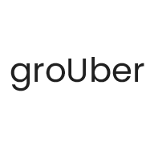

  

# groUber

Get your gang together, without the headache. [To the Moon and Hack Submission]

groups + Uber = groUber

## About

This project is aimed to help event planners create carpools, and is being built for To the Moon and Hack. If you're going to use this project to plan your event, remember to stay 6ft apart!

## Installation

### Stack

- TypeScript, React
- NPM
- Firebase

### Get in running

Run `npm start` for development.

Deployment happens via GitHub Actions.

## Usage

Add your participants data (address, can they drive, and number of seats in their car), and let the app go to work.

## Contributing

This will be updated after the hack-a-thon! Stay posted for more.
